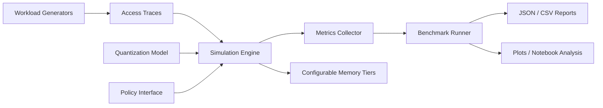
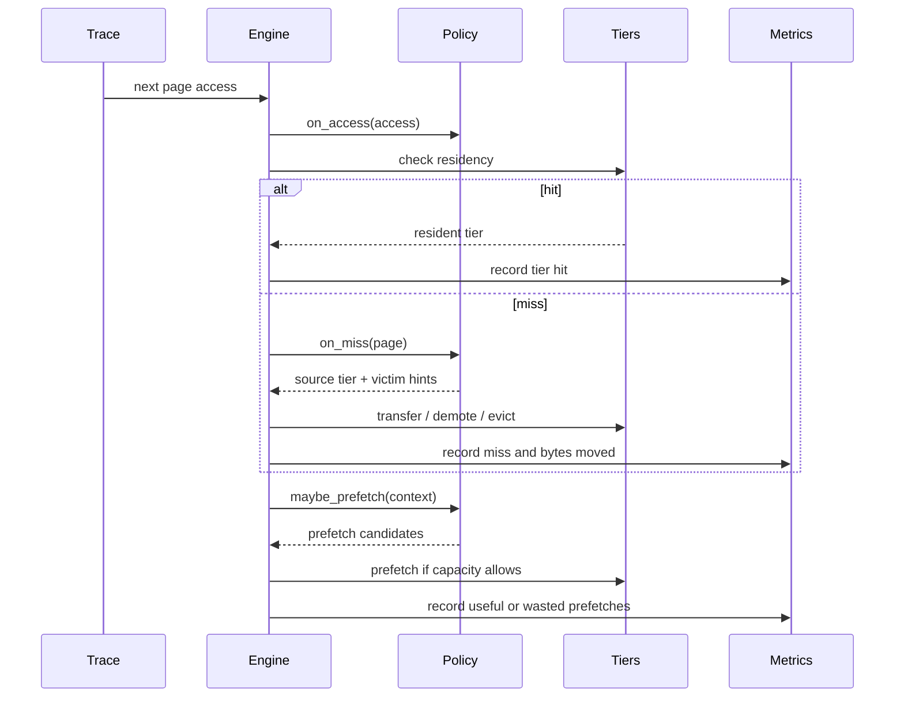

# kv-hierarchy-lab

**A trace-driven research harness for studying KV-cache residency, eviction, quantization, offload, and prefetch in long-context LLM inference.**

Modern long-context inference is often limited not just by compute, but by KV-cache residency and movement. Many ideas exist in isolation - paging, offload, quantization, token selection, predictive fetch - but comparing them cleanly is difficult. `kv-hierarchy-lab` provides a trace-driven, reproducible environment for studying those tradeoffs with a benchmark-first, claim-light approach.

The current version is hardware-aware but hardware-agnostic: it models tiers, costs, and policies without claiming a production kernel or runtime implementation. It is designed to support future runtime integration, not to pretend that simulation is deployment.

## Why This Repo Exists

Long-context serving discussions often mix together multiple concerns:

- which KV pages stay resident in the fastest tier
- which pages should be evicted or demoted
- when quantization changes the right residency decision
- how much traffic prefetch creates versus saves
- how trace structure changes policy rankings

There is a lot of good systems intuition in the space, but much of it is hard to compare because evaluation setups differ, trace assumptions are hidden, and results are not easy to reproduce. This repo exists to make those comparisons more explicit.

## What This Repo Is / Is Not

**This repo is:**

- a research harness
- a policy evaluation framework
- a bridge between systems ideas and future runtime or kernel integration
- trace-driven, reproducible, and benchmark-first
- intended for simulator studies, ablations, and policy prototyping

**This repo is not:**

- production-ready serving infrastructure
- a replacement for `vLLM`
- a claim that KV hierarchy problems are "solved"
- a magical CXL-backed 1M-token serving stack
- a repo that already ships custom Hopper kernels

v0.1 focuses on simulation, traces, policies, and evaluation. Future work may integrate with real runtimes such as `vLLM`, and may emulate or later support slower memory tiers such as host RAM or CXL-like backends more faithfully.

## Architecture



### Access / Miss / Prefetch Flow



## Core Concepts

### KV Pages

The simulator reasons about **KV pages** rather than entire sequences. A page carries:

- `page_id`
- token-span metadata
- layer index
- head-group metadata
- byte footprint
- quantization scheme
- current residency tier

This keeps the abstraction close to real cache movement decisions without pretending to model every runtime detail.

### Memory Tiers

v0.1 models configurable tiers such as:

- Tier 0: GPU-fast
- Tier 1: GPU-slower or overflow
- Tier 2: Host RAM
- Tier 3: NVMe-like backing store

These are costed tiers with configurable capacities, latencies, and bandwidths. They are not hard-coded to a specific machine.

### Access Traces

The simulator is **trace-driven**. A trace is a sequence of logical page accesses with timestamps or decode steps plus optional metadata such as sequence id, reuse hints, and whether the access is demand-driven or speculative.

### Eviction Policies

Policies decide which pages remain resident in the faster tiers and which pages get demoted or evicted when capacity is tight.

### Prefetch Policies

Prefetch policies speculate on near-future accesses. v0.1 includes a lightweight predictive policy based on recent transition structure and reuse frequency. It is intentionally modest and documented as such.

### Quantization-Aware Residency

Page size depends on quantization scheme. Smaller pages may remain resident longer, but optional decode penalties can shift the tradeoff. v0.1 models footprint and configurable dequant overhead only; it does not model quality degradation or full-model accuracy.

## What v0.1 Includes

- a trace-driven KV hierarchy simulator
- configurable multi-tier memory costs
- pluggable policy interfaces
- baseline policies: LRU, windowed recency, heavy hitter, cost-aware, predictive prefetch
- quantization-aware page footprints
- synthetic long-context workload generators
- benchmark runner with JSON and CSV outputs
- plotting utilities and a starter notebook
- tests for engine behavior, quantization, policies, and workloads

## Benchmarks And Metrics

The harness reports metrics that are useful for comparing policies without overclaiming:

- hit rate by tier
- total miss count
- average simulated access latency
- total bytes moved
- eviction count
- demand versus prefetch traffic
- useful prefetch ratio
- peak footprint per tier

The simulator is designed to answer relative policy questions under controlled assumptions. It does not replace runtime profiling.

### Sample Result Schema

```json
{
  "scenario": "chat_small_tier_fp16",
  "policy": "lru",
  "workload": "chat_continuation",
  "metrics": {
    "accesses": 4096,
    "miss_count": 812,
    "avg_latency_ms": 0.421,
    "bytes_moved": 73400320,
    "prefetch_usefulness": 0.31
  }
}
```

## Quickstart

```bash
git clone https://github.com/your-org/kv-hierarchy-lab.git
cd kv-hierarchy-lab
python -m venv .venv
source .venv/bin/activate  # Windows: .venv\Scripts\activate
pip install -r requirements.txt
pip install -e .
pytest
python scripts/run_benchmarks.py --output-dir output
python scripts/plot_results.py --results output/results.json --out-dir output/plots
```

Run a small example:

```bash
python examples/basic_simulation.py
python examples/compare_policies.py
```

## Repository Layout

```text
kv-hierarchy-lab/
├─ kv_hierarchy_lab/      # Core simulator, policies, quantization, workloads, bench
├─ scripts/               # CLI entry scripts for traces, benchmarks, and plotting
├─ examples/              # Minimal runnable examples
├─ notebooks/             # Analysis notebook seed
└─ tests/                 # Unit tests for simulator behavior
```

## Research Questions This Repo Helps Answer

- How sensitive are policy rankings to tier-capacity ratios?
- When does quantization reduce bytes moved enough to offset decode overhead?
- Which trace families benefit from predictive prefetch, and which punish it?
- How often does a frequency-biased policy beat pure recency under long-tail reuse?
- How much simulated latency reduction comes from better residency versus lower transfer volume?
- Which policies are robust across mixed chat, retrieval, and periodic reuse patterns?

## Caveats / Honesty Notes

- Synthetic traces are useful, but they are not equivalent to full-model correctness.
- Simulated latency is a model, not a substitute for actual GPU or runtime profiling.
- Tier names in v0.1 are abstractions over configurable cost models, not exact hardware contracts.
- Predictive prefetch in this repo is intentionally lightweight and should be read as a baseline.
- Future integrations may connect this harness to real runtimes such as `vLLM`, but that is not what v0.1 claims.

## Planned Future Work

- trace ingestion from runtime instrumentation
- tighter decode-step timing models
- richer multi-tenant and batched-serving traces
- more explicit transfer concurrency and overlap modeling
- runtime adapters for real serving stacks
- hardware-calibrated backends for host RAM and CXL-like tiers
- smarter learned predictors once the benchmark protocol is stable

## Open Research Directions

- jointly optimizing quantization and residency per layer or head-group
- modeling overlap between compute and transfer rather than pure additive latency
- selective retention for attention-relevant pages under retrieval-heavy traces
- offline oracle comparisons for upper-bound policy analysis
- building trace suites from real workloads without leaking proprietary serving traces

## Roadmap

| Version | Focus | Status |
| --- | --- | --- |
| v0.1 | Trace-driven simulator, baseline policies, synthetic workloads, benchmark harness | Included |
| v0.2 | Runtime trace ingestion, richer event model, better transfer overlap modeling | Planned |
| v0.3 | Runtime integration experiments, calibrated tier backends, policy training loops | Exploratory |

## How To Extend With A New Policy

1. Subclass `BasePolicy`.
2. Implement `select_eviction_candidate` and optionally `maybe_prefetch`.
3. Use `on_access`, `on_insert`, and `on_evict` to maintain internal state.
4. Add the policy to `kv_hierarchy_lab/policies/__init__.py`.
5. Compare it with `python examples/compare_policies.py` or the benchmark runner.

## Contribution Guidelines

Contributions are welcome, especially in:

- better trace models
- clearer benchmark scenarios
- policy baselines and oracle analyses
- runtime-integration adapters
- documentation and reproducibility improvements

Please keep the tone empirical and claim-light. If a contribution introduces a performance claim, it should include the trace assumptions, simulator configuration, and reproduction steps.

## License

This repository is released under the MIT License. See [LICENSE](./LICENSE).
