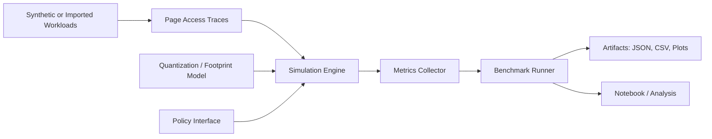
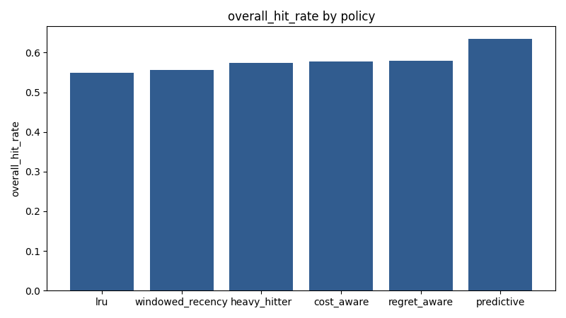
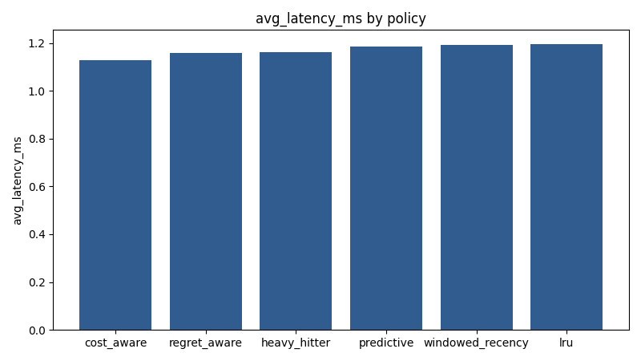
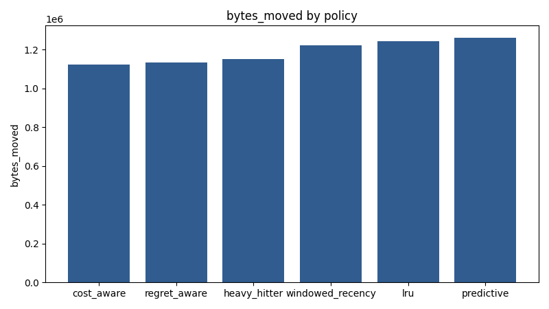
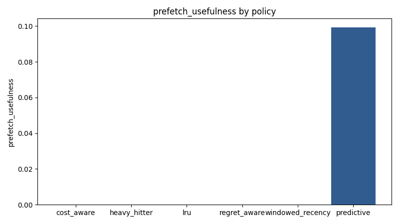
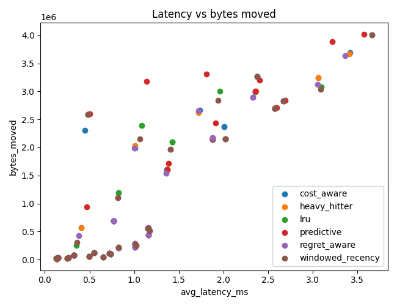

# kv-hierarchy-lab

**Trace-driven policy evaluation for KV-cache hierarchy decisions in long-context LLM inference**

`kv-hierarchy-lab` is a benchmark-first research harness for studying KV-cache residency, eviction, quantization, offload, and prefetch tradeoffs under long-context decoding. It is designed for reproducible simulator studies today, and for future integration with real runtimes later.

Modern long-context inference is often limited not just by compute, but by KV-cache residency and movement. Many ideas exist in isolation, but comparing them cleanly is awkward. This repo provides a hardware-aware, hardware-agnostic v0.1 environment for asking those questions without pretending to be a production serving stack.

## Why This Repo Exists

Long-context serving work often blends together:

- which KV pages stay resident in the fastest tier
- which pages should be demoted or evicted
- when footprint reduction changes the right residency choice
- whether prefetch reduces misses or only adds traffic
- how much a result depends on trace structure rather than policy quality

This repo exists to make those tradeoffs inspectable. The goal is not to "solve KV cache inference" in one repo. The goal is to provide a trace-driven, reproducible policy evaluation framework that systems and inference engineers can extend, question, and calibrate.

## What It Is / Is Not

**This repo is:**

- a research harness
- a policy evaluation framework
- benchmark-first and claim-light
- reproducible and trace-driven
- designed to support future runtime integration

**This repo is not:**

- production-ready serving infrastructure
- a replacement for `vLLM`
- a claim of custom kernel or Hopper-specific runtime work
- a magical CXL-backed 1M-token system
- a substitute for real GPU profiling

v0.1 focuses on simulation, traces, policies, and evaluation. Future revisions may ingest real traces, calibrate against serving runtimes, and model slower tiers such as host RAM or CXL-like backends with more fidelity.

## Architecture



The engine models page movement across configurable tiers, applies policy hooks on access and eviction, and records simulated latency and traffic rather than claiming runtime throughput.

## Core Concepts

### KV Pages

The simulator works on **KV pages**, not full sequences. A page carries:

- `page_id`
- token span
- layer index
- head-group metadata
- byte footprint
- quantization scheme
- current tier

### Memory Tiers

The default hierarchy models configurable cost tiers such as:

- Tier 0: GPU-fast
- Tier 1: GPU-overflow
- Tier 2: Host RAM
- Tier 3: NVMe-like backing store

These tiers are latency and bandwidth models, not claims about exact hardware support.

### Access Traces

The harness is **trace-driven**. A trace is a sequence of logical page accesses with decode-step ordering and optional metadata. v0.1 ships synthetic workloads; future revisions can ingest runtime traces.

### Eviction Policies

Policies decide which pages stay in fast tiers, which pages are demoted, and which choices are repeatedly costly.

### Prefetch Policies

Prefetch policies speculate on future accesses. In v0.1, the predictive baseline is intentionally modest, and the harness reports usefulness rather than just raw prefetch count.

### Quantization-Aware Residency

Footprint depends on quantization scheme. Smaller pages may improve residency, while optional decode penalties can offset some of that benefit. The simulator models footprint and configurable dequant overhead only; it does not model model quality or accuracy loss.

## What v0.1 Includes

- a trace-driven KV hierarchy simulator
- configurable multi-tier latency, capacity, and bandwidth models
- pluggable policy interfaces
- baseline policies: `lru`, `windowed_recency`, `heavy_hitter`, `cost_aware`, `predictive`
- a signature `regret_aware` eviction policy
- quantization-aware page footprints for `fp16`, `fp8`, `int4`, and `int2`
- synthetic workloads including retrieval bursts, periodic reuse, mixed locality, and adversarial bursts
- benchmark runner with committed JSON, CSV, and plot artifacts
- tests for engine behavior, prefetch accounting, quantization, workloads, and policy correctness

## Initial Findings

These are **simulator findings on synthetic traces**, not runtime performance claims.

- On `small_fp16_prefetch` + `rag_burst`, `regret_aware` reduced misses from `212` to `152` versus `lru` and cut bytes moved by `26.3%`.
- On `constrained_fp16_prefetch` + `adversarial_burst`, `regret_aware` delivered the lowest latency in the sweep: `3.365 ms` average simulated access latency versus `3.664 ms` for `lru`, with `9.5%` fewer bytes moved.
- On `small_fp16_prefetch` + `prefetch_friendly`, the `predictive` policy cut misses by `59.6%` versus `lru`, but still had `29.2%` higher latency than `cost_aware`. Lower miss count did not automatically mean a better latency outcome once speculative traffic was included.
- Under the same small no-prefetch tier budget, switching from `fp16` to `int4` on `rag_burst` raised mean overall hit rate from `0.459` to `0.771` and reduced bytes moved by `93.9%`. Footprint alone can dominate policy differences under pressure.

### Regret-Aware Ablation

A dedicated ablation study (see `scripts/run_regret_ablation.py`) sweeps `regret_horizon` and `regret_weight` parameters to isolate the policy's theoretical advantages on simulated traces without prefetch noise:

- **Adversarial Bursts:** Under constrained capacity on `adversarial_burst`, baseline `lru` experienced `3.66 ms` average latency. `cost_aware` dropped this to `3.22 ms`. The best Regret-Aware config (`weight=1.0, horizon=12`) outperformed both at `2.96 ms` latency, minimizing thrashing by anchoring high-regret pages locally.
- **Horizon Sensitivity:** Shorter horizons (12-24 steps) generally yielded better latency characteristics than long horizons (96 steps) under severe pressure, suggesting that "forgetting" past regret is necessary when working sets turn over continuously.
- **Failure/Neutral Case:** On purely recency-heavy traces like `chat_continuation`, `regret_aware` provided exactly identical hit rates and latency as bare `lru` (`0.323 ms`), confirming that regret logic offers no advantage when older pages inherently never return.


## Benchmarks And Metrics

The default sweep reports:

- overall hit rate by policy
- hit rate by serving tier
- miss count
- average simulated access latency
- bytes moved
- demand versus prefetch traffic
- useful prefetch ratio
- eviction count
- peak footprint per tier

Committed simulator artifacts live under [artifacts/default_sweep](./artifacts/default_sweep).

### Default Sweep Figures

Simulator outputs generated from the committed default sweep:







### Result Files

- [results.json](./artifacts/default_sweep/results.json)
- [results.csv](./artifacts/default_sweep/results.csv)
- [run_metadata.json](./artifacts/default_sweep/run_metadata.json)

## Quickstart

```bash
git clone https://github.com/manishklach/kv-hierarchy-lab.git
cd kv-hierarchy-lab
python -m venv .venv
source .venv/bin/activate  # Windows: .venv\Scripts\activate
pip install -r requirements.txt
pip install -e .
python -m pytest
```

Minimal smoke run:

```bash
python examples/basic_simulation.py
```

## Reproducing The Default Sweep

One-command path with `make`:

```bash
make test
make bench
make plots
```

Equivalent direct commands:

```bash
python -m pytest
python scripts/run_benchmarks.py --output-dir artifacts/default_sweep
python scripts/plot_results.py --results artifacts/default_sweep/results.json --out-dir artifacts/default_sweep/plots
```

The committed sweep artifacts were generated with:

```bash
python scripts/run_benchmarks.py --output-dir artifacts/default_sweep
python scripts/plot_results.py --results artifacts/default_sweep/results.json --out-dir artifacts/default_sweep/plots
```

## Repository Layout

```text
kv-hierarchy-lab/
├─ kv_hierarchy_lab/
│  ├─ simulator/     # Engine, tier model, traces, metrics
│  ├─ policies/      # Eviction and prefetch policies
│  ├─ quant/         # Footprint and decode-penalty models
│  ├─ workloads/     # Synthetic workload generators
│  ├─ bench/         # Scenarios, runner, report helpers
│  └─ utils/         # Plotting and I/O helpers
├─ scripts/          # Benchmark, trace, and plotting entrypoints
├─ artifacts/        # Committed simulator outputs for inspection
├─ examples/         # Small runnable examples
├─ notebooks/        # Analysis notebook seed
└─ tests/            # Unit tests
```

## Adding A New Policy

1. Subclass `PolicyBase` or match the `BasePolicy` protocol.
2. Implement `select_eviction_candidate`.
3. Optionally implement `maybe_prefetch` and `on_promote`.
4. Keep internal state in `on_access`, `on_insert`, and `on_evict`.
5. Export the new policy from `kv_hierarchy_lab/policies/__init__.py`.
6. Compare it with `python examples/compare_policies.py` or the default sweep.

The signature `regret_aware` policy is a good reference because it adds a distinct idea without introducing runtime-specific complexity.

## Open Research Questions

- When does a regret signal beat plain recency or frequency under realistic trace churn?
- How should quantization and residency be co-optimized per layer or head-group?
- What overlap model is needed before transfer cost becomes a decent proxy for wall time?
- Which workloads most consistently punish speculative prefetch despite high apparent reuse?
- How should offline oracle analyses be used to bound achievable policy gains?

## Caveats / Honesty Notes

- Synthetic traces are not substitutes for full-model correctness.
- Simulated latency is not a substitute for real GPU profiling.
- Tier names are abstractions over cost models, not direct hardware contracts.
- The committed figures are simulator artifacts, not runtime benchmarks.
- Future runtime integrations may connect this harness to systems such as `vLLM`, but that is future work, not a current claim.

## Roadmap

| Milestone | Focus | Concrete next step |
| --- | --- | --- |
| v0.1 | Trace-driven simulator, baselines, artifacts, reproducibility | Landed in this repo |
| v0.2 | Runtime trace ingestion and calibrated event model | Import serving traces and replay them through the same benchmark harness |
| v0.3 | Better overlap and concurrency modeling | Add explicit transfer concurrency and compute-overlap assumptions |
| v0.4 | Runtime integration experiments | Attach the harness to a real serving runtime for trace capture and replay |

## License / Contribution Note

This repository is released under the MIT License. Contributions are welcome, especially around trace ingestion, better workload suites, calibrated tier models, and policy ablations. Please keep changes empirical, reproducible, and careful about what is and is not being claimed.
